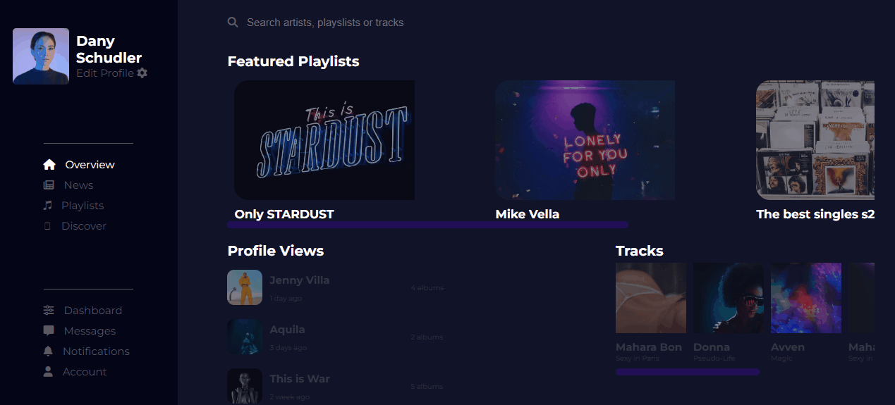

<h1 style='font-size: 40px'>Music Library</h1>

The Music Library is a challenge proposed by the DevChallenge website and aims to create a music library page

The project has two versions, a mobile version and a desktop version.

    
    
<h2 style='font-size: 25px'>the following technologies were used for the development of the application:</h2>

- HTML5

- CSS3

- Javascript
